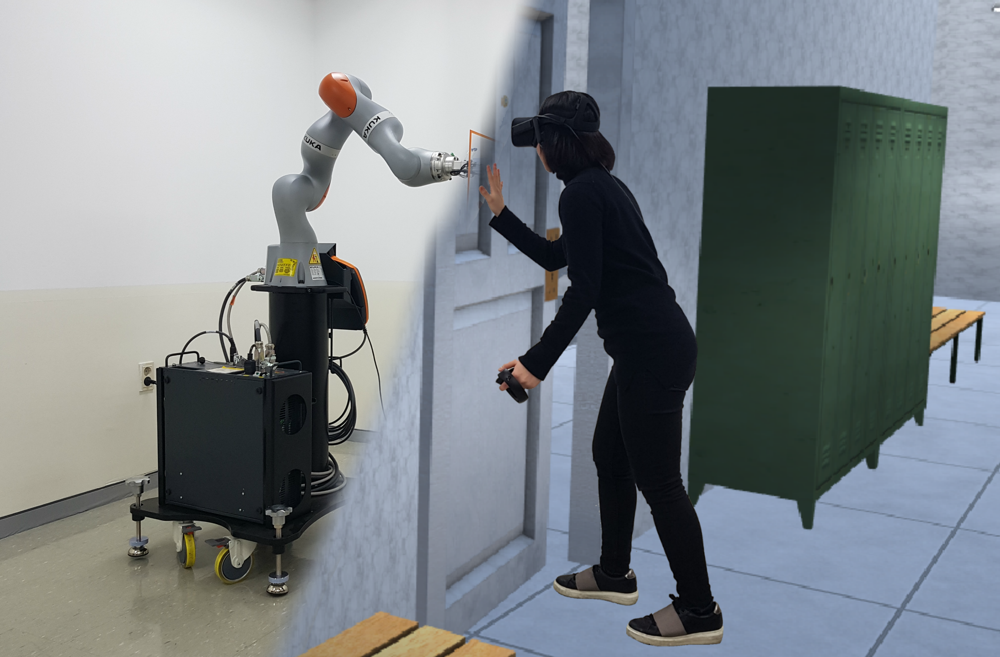

# Haptic Wall

Encountered-type Haptic Display using Cooperative robot!        
        
        



    

***
## Further information    
For the further information, please refer to the paper and video below:


***
## Citation   
If you use this sources, please cite the following paper:
```
@ARTICLE{kim2018hwall,
  author = {Kim, Yaesol and Kim, Hyun Jung and Kim, Young J.},
  title = {Encountered-type haptic display for large VR environment using per-plane reachability maps},
  journal = {Computer Animation and Virtual Worlds},
  year = {2018},
  volume = {29},
  number = {3-4},
  pages = {e1814},
  doi = {https://doi.org/10.1002/cav.1814},
  url = {https://onlinelibrary.wiley.com/doi/abs/10.1002/cav.1814},
  eprint = {https://onlinelibrary.wiley.com/doi/pdf/10.1002/cav.1814}  
}
```
